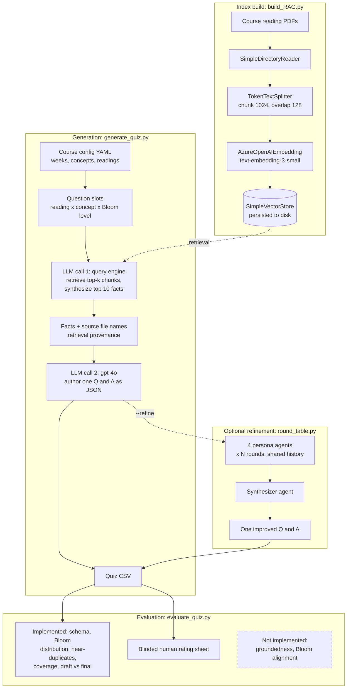

# QuizGen-RAG

Retrieval-augmented generation of Bloom's-taxonomy-targeted short-answer quiz questions from a course's assigned readings. Built and used to produce the weekly formative quizzes for AIM2, "Introduction to AI in Medicine," which I taught at Harvard Medical School.

[](https://github.com/gkuling/QuizGen-RAG/actions/workflows/ci.yml) [](LICENSE) [](https://www.python.org/)

## Architecture



## What this is and why it exists

Writing a fresh short-answer quiz every week for a graduate course is a real time sink, and questions written under time pressure drift toward recall. Bloom's Taxonomy gives a vocabulary for that drift: a quiz made entirely of "define X" items tells you almost nothing about whether students can compare two modeling approaches or critique a validation design.

QuizGen-RAG makes the cognitive level an explicit input rather than an accident. It enumerates one question slot per (assigned reading, weekly concept, Bloom's level) triple, grounds each slot in chunks retrieved from the course readings, and asks an LLM to author a question and a reference answer at that level. The quizzes are formative -- they exist to show the instructor where the class is, not to grade anyone -- which is what makes an instructor-in-the-loop workflow acceptable and a fully autonomous one unnecessary.

## How it works

**Index build.** `build_RAG.py` reads every PDF in a folder with `SimpleDirectoryReader`, splits them with a `TokenTextSplitter` (`--chunk-size` 1024, `--chunk-overlap` 128), embeds the chunks with the Azure OpenAI `text-embedding-3-small` deployment, and persists a llama-index `SimpleVectorStore` to `--vec-store`. An existing store is loaded rather than rebuilt unless `--force-rebuild` is passed. `--smoke-test-query TEXT` runs one query against the finished index.

**Slot enumeration.** `generate_quiz.py` loads the week from a course config (`--course-config`, default `configs/aim2_course.yaml`) and builds the full cross product of readings, concepts, and the six Bloom's levels. `--num-questions -1` (the default) emits every slot exactly once; a positive value repeats the cross product as needed, shuffles it with `random.Random(--seed)`, and truncates.

**Two LLM calls per question.** Call one goes through the llama-index query engine: it retrieves the chunks most similar to the reading plus concept, and asks the model to return the top 10 facts relevant to the learning objective. Call two hands those facts, the citation, the concept, and the level-specific instruction from `blooms.py` to a `gpt-4o` deployment, which returns one question and answer as JSON. Splitting the work this way keeps the authoring prompt short and, more importantly, produces a durable grounding artifact: the facts text and the source file names of the retrieved nodes are both written into the output CSV, so a saved quiz can be audited after the fact. The cost of that split is that the facts are themselves unverified model output -- a lossy or fabricated summary at step one becomes the only evidence step two ever sees, and the error propagates silently into both the question and its answer key. This is the largest correctness risk in the pipeline and the reason the evaluation section below is written the way it is.

**Failure handling.** Responses are parsed with `json.loads`, tolerating Markdown code fences and falling back to the first `{...}` span; nothing uses `eval`. A parse failure logs a warning naming the `question_id`, increments a counter, and skips the slot, and the run ends by printing `Generated N/M questions`. Validation is ordered so that arguments, the course config, the week, and the vector store path are all checked *before* any Azure client is constructed, so `--week-number 99` fails with a clean message listing the valid weeks even with no credentials present. No module in this repo reads the environment or builds a client at import time.

## Agentic refinement (the round table)

`round_table.py` is an optional multi-agent revision pass, enabled with `--refine`. It began life in a medical-education deployment as feedback-driven revision tooling: after a quiz had been administered, four persona agents read each question alongside the student grade-distribution report and proposed fixes. Here the same machinery runs at generation time instead, with the target Bloom's level and the grounding facts occupying the slot the feedback report used to fill.

Four personas -- Pedagogical Expert (Bloom's alignment), Content Accuracy (a medical-science reviewer), Feedback Integration (rubric and assessment design), and Innovative Perspective -- each produce one suggestion per round, alongside course context retrieved live from the vector store for the draft pair. Rounds accumulate: round two sees round one's full transcript, so the personas can build on or push back against each other. A synthesizer agent then folds the whole discussion into exactly one improved question and answer in the same strict JSON schema, so the result drops straight back into the pipeline. If the synthesizer's output does not parse, the run logs a warning and keeps the draft.

The design choice worth pointing at: `round_table.refine_qa` takes an injected `chat_fn(system, user) -> str` rather than importing llama-index. `generate_quiz.py` supplies a thin adapter around `llm.chat`; the test suite supplies a fake. The module has no llama-index import, no module-level client, and no network dependency, so round accumulation, prompt assembly, and synthesis parsing are all unit-testable offline and in CI.

Refinement is off by default because it is expensive: `(--refine-rounds x 4)` persona calls plus one synthesizer call plus one extra retrieval query, per question, on top of the two base calls.

## Quickstart

Python 3.13 or newer. CI runs 3.13; dependencies were last resolved against 3.14.

```bash
git clone https://github.com/gkuling/QuizGen-RAG.git && cd QuizGen-RAG && pip install -r requirements.txt

cp .env.example .env   # then fill in AZURE_OPENAI_API_KEY and your two endpoints

python build_RAG.py --pdf-folder ./course_readings --vec-store ./vec_store

python generate_quiz.py --week-number 3 --num-questions 5 --vec-store ./vec_store --output-dir ./quizzes
```

That writes `./quizzes/week_03_quiz.csv`. Add `--refine` (and optionally `--refine-rounds 2`) for the round-table pass; `--vec-store` falls back to the `QUIZGEN_VEC_STORE` environment variable. `generate_quiz.py` exits 0 on success, 1 on a clean configuration error (unknown week, malformed config, missing vector store, missing credentials), and 2 when no vector store was given at all.

The offline checks need no credentials:

```bash
python evaluate_quiz.py --quiz-csv quizzes/week_03_quiz.csv --course-config configs/aim2_course.yaml
```

## Configuration

The course schedule is data, not code. `configs/aim2_course.yaml` holds the 13-week AIM2 schedule; point `--course-config` at your own file to run the pipeline for a different course.

```yaml
course:
  id: AIM2
  title: Introduction to AI in Medicine
weeks:
  - week: 1
    title: "Natural Language Processing (NLP) I"
    concepts:
      - "Introduction to NLP"
      - "NLP in a clinical setting"
    required_readings:
      - "Singhal, et al. (2023). Large language models encode clinical knowledge."
```

Each week needs an integer `week`, a non-empty `title`, a non-empty `concepts` list, and a non-empty `required_readings` list. A reading may be a plain citation string, as above, or a mapping that ties the citation to a document in the corpus:

```yaml
    required_readings:
      - citation: "Devlin, J., et al. (2019). BERT: Pre-training of deep bidirectional transformers."
        source_file: "devlin_2019_bert.pdf"
```

Supplying `source_file` makes the coverage check in `evaluate_quiz.py` exact for that reading, matching the `source_files` column instead of falling back to a text heuristic. JSON configs work too; the loader dispatches on file suffix and uses `yaml.safe_load` only. Validation errors name the offending week and field.

Credentials come from `.env` (see `.env.example`). `AZURE_OPENAI_API_KEY`, `AZURE_OPENAI_ENDPOINT`, and `AZURE_OPENAI_EMBEDDING_ENDPOINT` are required; deployment names and API versions are optional overrides of the defaults (`gpt-4o`, `text-embedding-3-small`).

## Output schema

One CSV per week, written to `<output-dir>/week_NN_quiz.csv`.

| Column | Description |
| --- | --- |
| `question_id` | Stable identifier, `w<week>-q<slot>`, e.g. `w03-q007`. |
| `week` | Week number the question was generated for. |
| `taxonomy` | Requested Bloom's level: Knowledge, Understanding, Applying, Analyzing, Evaluating, or Creating. |
| `learning_objective` | The weekly concept the slot targeted. |
| `reference` | Citation text of the assigned reading for the slot. |
| `source_files` | Semicolon-joined file names of the chunks retrieval actually used. Retrieval provenance. |
| `facts` | The "top 10 facts" text from LLM call one; the evidence call two was given. |
| `question` | The final question text. |
| `answer` | The final reference answer. |
| `model` | Chat deployment name used, e.g. `gpt-4o`. |
| `generated_at` | ISO-8601 UTC timestamp of the run. |

With `--refine`, three more columns are appended:

| Column | Description |
| --- | --- |
| `draft_question` | The pre-refinement question from LLM call two. |
| `draft_answer` | The pre-refinement answer. |
| `refined` | Whether the round table produced a parseable replacement for this item. |

Keeping the draft alongside the final is what makes the refinement pass auditable rather than a black box: `evaluate_quiz.py` reports per-item draft-to-final similarity and word-count deltas.

## Evaluation and limitations

**The questions this system produces have not been systematically evaluated.** The only quality control ever applied was my own review of each week's output before it reached students -- no rubric, no blinding, no second rater, no inter-rater reliability. I edited or discarded questions I judged weak, but I did not record which ones or why. Any claim that this pipeline produces *good* questions would be unsupported, so this README does not make one. What follows is what the code checks today and what a real evaluation would have to look like.

### What `evaluate_quiz.py` checks today

These checks are structural and run offline with no API keys. They are necessary but nowhere near sufficient: a quiz can pass every one of them and still be full of subtly wrong answers.

- **Schema and consistency:** empty questions or answers, taxonomy strings that are not recognized Bloom's levels, duplicate `question_id`s, answers over the 200-word limit stated in the system prompt, and empty `facts` fields.
- **Bloom's distribution:** counts and proportions across all six levels (zeros included) plus an unknown bucket, summarized as normalized Shannon entropy in [0, 1].
- **Near-duplicate detection:** normalized text compared pairwise with `difflib.SequenceMatcher` (`--duplicate-threshold`, default 0.85), reported separately for within-week and cross-week pairs.
- **Coverage:** which of a week's configured concepts and required readings drew zero questions. Exact when `source_file` is configured, a documented text heuristic otherwise.
- **Draft vs final:** similarity and length deltas for quizzes generated with `--refine`.
- **Blinded rating sheet:** `--emit-rating-sheet ratings.csv` writes `question_id, question, answer` plus empty `rated_bloom_level, factually_correct, answerable_from_reading, would_use, comments` columns. The requested taxonomy is deliberately withheld so a human rater classifies the level blind.

```bash
python evaluate_quiz.py --quiz-csv quizzes/week_03_quiz.csv \
    --course-config configs/aim2_course.yaml \
    --emit-rating-sheet ratings.csv --report-json report.json --strict
```

Exit codes: 0 clean, 1 when `--strict` is set and any schema finding was reported, 2 when an unimplemented check was requested. `--check-groundedness` and `--check-bloom-alignment` are honest `NotImplementedError` stubs; asking for them prints one explanatory line and exits 2, never a traceback. Their docstrings carry the full implementation TODO, including the requirement to calibrate any LLM judge against human labels before reporting a number from it.

### The evaluation protocol I would run

Target sample: roughly 60 questions stratified across weeks and all six Bloom's levels, rated independently by 2 instructors or teaching fellows using the blinded sheet above.

1. **Bloom's level agreement.** *Method:* raters assign a level blind to the requested one; build a 6x6 requested-vs-assigned confusion matrix. *Metric:* quadratic weighted Cohen's kappa, since the levels are ordinal and near-misses should not be penalized like far ones, plus rater-vs-rater kappa as the ceiling. *Falsifiable hypothesis:* requests for Analyzing and Evaluating collapse toward Understanding-level questions more often than requests for Knowledge and Applying do. A row-normalized confusion matrix either shows that mass or it does not.
2. **Faithfulness to the corpus.** *Method:* decompose each reference answer into atomic claims and check entailment against both the stored `facts` field and chunks re-retrieved live from the vector store; calibrate the judge against the human `factually_correct` labels before trusting it. *Metric:* proportion of claims entailed, reported alongside judge-vs-human kappa. An uncalibrated faithfulness number is not evidence.
3. **Answerability from the assigned reading.** *Method:* raters judge whether a student who read only that slot's assigned reading could answer the question. *Metric:* proportion answerable. Deliberately distinct from item 2: retrieval runs over the whole corpus, so a question can be perfectly grounded in the course materials and still be unfair to assign against one paper.
4. **Instructor utility.** *Method:* log the accept / edit / reject decision for every generated question over a term, plus edit distance for the accepted-with-edits bucket. *Metric:* accept-without-edit rate. This is the number that decides whether the tool saves preparation time, and it is the one I most regret not logging while teaching.
5. **Coverage and redundancy.** *Method:* run the implemented coverage and near-duplicate checks across a full term rather than one week. *Metric:* proportion of concepts and readings with at least one question, and the near-duplicate rate at a threshold validated against human "these are the same question" judgments.

### Known limitations

- **Retrieval is corpus-wide.** The query engine searches every indexed document, not just the reading named in the slot, so a question labeled with one citation may be grounded in a chunk from a different paper. Per-reading metadata filtering is the obvious fix and is deliberately not shipped here: without item 3 above there would be no way to show it helped.
- **The facts step is unverified.** LLM call one's output is the sole evidence LLM call two sees, and nothing checks it against the retrieved chunks.
- **Answer keys are model-generated.** The `answer` column is written by `gpt-4o`, not by a domain expert. Treat it as a draft for the instructor to approve.
- **Reproducibility is partial.** `--seed` makes slot selection deterministic; it does not make generation deterministic. The LLM's own sampling is not seeded, and even at temperature 0 provider-side inference is not bit-reproducible across runs. Re-running a week reproduces the same slots, not the same questions.
- **Single model, single prompt, single run.** No ablation over models, prompts, chunk sizes, or retrieval depth, and no repeat-run variance estimate.
- **No patient data is involved.** The corpus is published literature and lecture material. The pipeline was never pointed at PHI, and the "clinical scenario" framing in the Applying and Creating prompts asks the model to invent illustrative cases, not to reuse real ones.

## Design notes and what I would change

- **Structured output instead of parse-and-hope.** The JSON tolerance in `_parse_qa_response` (fence stripping, brace extraction) exists because chat models wrap JSON in prose. Azure's structured-output mode would retire that machinery and turn a silent skip into a schema guarantee.
- **Pass chunks, not a summary.** The strongest single change would be dropping the facts step and handing retrieved chunks directly to the authoring call, with per-reading metadata filtering. I kept the two-call design because it produces the auditable `facts` column, but the right version stores the raw chunks *and* skips the lossy intermediate.
- **The evaluation harness should have come first.** The schema that makes offline groundedness checking possible at all -- recording `question_id`, `facts`, and `source_files` -- landed in this refactor, not in the version I taught with, so every question generated during the course is unauditable. Build the thing that measures the output before the thing that produces it.
- **Cost and latency are unmanaged.** Calls are sequential, with no batching, caching, or retry policy. A full 13-week generation with `--refine` is a lot of serial round trips.
- **Short-answer only.** Multiple-choice generation with plausible distractors is a genuinely harder problem, and distractor quality would need an evaluation of its own.

## Repository layout

```
build_RAG.py        Build or load the persisted vector store from a folder of PDFs
generate_quiz.py    Slot enumeration, two-call generation, CSV output
evaluate_quiz.py    Offline structural checks, rating sheet, judge stubs
round_table.py      Multi-agent refinement with a dependency-injected chat_fn
BTQ_prompt.py       Grounded prompt assembly, retrieval provenance capture
blooms.py           Bloom's levels, descriptions, per-level instructions
azure_config.py     Azure OpenAI settings loading and llama-index wiring
course_config.py    Course schedule loading and validation
configs/            aim2_course.yaml, the 13-week AIM2 schedule
tests/              pytest suite plus offline fixtures
```

## License

MIT. See [LICENSE](LICENSE).

## Acknowledgments

Built for AIM2, "Introduction to AI in Medicine," at Harvard Medical School. Thanks to Marinka Zitnik, my advisor, for the opportunity to teach the course this tool was written for.
